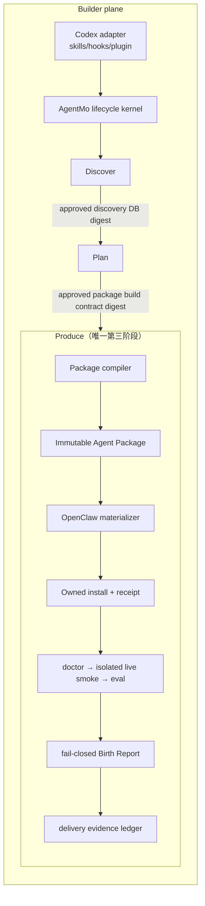

# Architecture Patterns

**Project:** AgentMo
**Domain:** coding agent 驱动的领域智能体构建协议与 OpenClaw Agent Package 工具链
**Researched:** 2026-07-11
**Overall confidence:** MEDIUM（当前 AgentMo 边界为直接代码事实；跨项目借鉴属于架构推导）

## Recommended Architecture

AgentMo 应继续原地演进为一个 **contract-first、artifact-driven、local-first** 的系统，而不是重写为常驻服务。规范内核只认识恰好三个顶层阶段：`Discover -> Plan -> Produce`。Codex adapter 把这个内核安装到构建端；OpenClaw target adapter 把经批准的 build contract 编译为 Agent Package。两类 adapter 都不能成为业务事实的规范源。



### Architectural Invariants

| Invariant | Required consequence |
|---|---|
| 顶层阶段恰好三个 | install、doctor、live smoke、eval、Birth Report、delivery、upgrade、rollback、uninstall 都是 Produce 内部步骤，不能成为第四阶段 |
| Builder plane 与 Package plane 分离 | AgentMo 方法论的 Codex plugin 不得被复制进每个领域包；领域包也不得反向成为 builder 的状态源 |
| 工件而非命令历史连接阶段 | Plan 只依赖已批准 discovery contract；Produce 只依赖已批准 package build contract |
| 支持声明来自实现与证据 | v1 仅 Codex builder 与 OpenClaw target 可标为 production-grade；其他 adapter 只发布协议与 unsupported surfaces |
| 新输出只有 AgentMo 身份 | `agentmother_*` 仅进入受控兼容读取/迁移层，任何新 schema、CLI、包和证据只写 `agentmo_*` |

### Component Boundaries

| Component | Responsibility | Communicates With |
|---|---|---|
| `lifecycle-kernel` | 三阶段状态机、阶段 admission、恢复与显式命令路由 | builder adapter、contract registry、artifact store |
| `contract-registry` | schema 版本、validator、hash、旧格式 migration；禁止隐式兼容 | 所有阶段、package compiler |
| `artifact-store` | 原子写入、内容寻址、索引、append-only approval/decision refs | 三阶段、evidence ledger |
| `builder-adapter-contract` | capability negotiation、event map、context injection、compaction recovery、dedupe、unsupported surfaces | lifecycle kernel |
| `codex-adapter` | v1 唯一完整 builder；分发 skills/hooks/plugin，映射 Codex 事件和安装布局 | lifecycle kernel、Codex host |
| `discover-engine` | collector 调度、清洗、去重、source cards/chunks/facts、source manifest proposal | Codex research capabilities、approval gate |
| `approval-gate` | 将人工决定绑定到精确 artifact digest、范围、时间和决策人 | Discover、Plan、敏感 Produce 动作 |
| `plan-engine` | 形成 need、decision ledger、blueprint、capability requirements、Package build contract | approved discovery DB、human dialogue |
| `package-compiler` | 从 build contract 确定性地产生不可变 Agent Package 和 payload digests | target adapter、eval definitions |
| `target-adapter-contract` | `probe/plan/materialize/inspect/install/doctor/smoke/evaluate/upgrade/rollback/uninstall` 的声明式协议 | package compiler、managed executor |
| `openclaw-adapter` | v1 唯一完整 target；选择 workspace/bundle/config/MCP/native plugin 投影 | OpenClaw CLI 与显式 state root |
| `managed-executor` | 先 plan 后 apply；只执行有边界 operation；共享文件使用字段级 patch | ownership ledger、OpenClaw adapter |
| `ownership-ledger` | package digest、installed paths/fields、before/after digest、backup/receipt、冲突检测 | install、upgrade、rollback、uninstall |
| `runtime-verifier` | probe、doctor、隔离 OpenClaw 执行、超时清理和有界输出摘要 | explicit `OPENCLAW_STATE_DIR`、evidence ledger |
| `evidence-ledger` | 独立记录 declared/live/domain/production 证据，重新验证而非信任上游 `ok` | eval、Birth Report、delivery report |
| `observe-proposer` | 从运行证据生成变更提案 | human review；永不直接写 blueprint/package/runtime |

### Canonical Artifact Topology

推荐把“不可变包”和“可变实例证据”分开：

```text
<agent-id>-<version>/
├── agentmo.package.json              # id/version/schema/target/compat/digests/trust requests
├── contracts/
│   ├── blueprint.json
│   ├── package-build-contract.json
│   └── provenance.json               # approved source refs + digests；不内嵌敏感原文
├── payload/openclaw/
│   ├── workspace/                    # AGENTS/SOUL/TOOLS/IDENTITY/USER/skills/memory policy
│   ├── config/                       # patch-shaped；不是完整 openclaw.json
│   ├── bundle/                       # 仅在能力需要时
│   └── plugin/                       # 仅 typed hook/in-process tool 确有必要时
├── evals/                            # case definitions、rubrics、hard failures
└── docs/                             # install/runbook/known risks

<instance-evidence>/                  # 不属于不可变 package payload
├── install-receipt.json
├── doctor-report.json
├── live-run-state.json
├── domain-eval.json
├── birth-report.json
└── delivery-report.json
```

Package manifest 必须记录每个文件的 digest、来源 component、目标路径类别、能力归属、host/target 兼容区间和信任请求。安装后产生的 receipt 与运行证据引用 package digest，不能回写并改变包本身。

### Data Flow

1. **Discover**：Codex adapter 调用 Web/GitHub/论文/本地文档 collector；输入先经过路径、内容、大小和 secret screening，再生成 source cards、chunks、facts 和带置信度的 source manifest。
2. 人工批准 source manifest 与 discovery DB 的精确 digest；未批准、已变更或来源链断裂时，Plan admission 失败关闭。
3. **Plan**：人机对话只持久化有边界的需求、决策、异议、约束和 source refs，不把原始私密对话当常规工件；最终生成 blueprint 与 Package build contract。
4. 人工批准 build contract digest；后续修改必须产生新版本和新批准，不能沿用旧批准。
5. **Produce**：compiler 在 staging 中生成 package，执行 schema、digest、determinism、secret、path 与 capability lint，然后冻结 package digest。
6. OpenClaw adapter 先 `probe`/`plan`，再在隔离 state/workspace 中 materialize；managed executor 仅应用 receipt 可证明归属的 operation。
7. doctor 证明安装/配置/依赖接线；isolated live smoke 证明一次真实执行；domain eval 只证明给定 case suite；Birth Report 与 delivery report 重新校验这些独立证据。
8. 生产发布、真实渠道绑定和写作智能体发布工具调用必须另有人工批准；批准绑定确切内容 digest、route 与有效期，草稿变化或超时即拒绝。

### Ownership, Security, and Evidence Boundaries

| Surface | Owner | Boundary |
|---|---|---|
| methodology、stage contract | AgentMo core | adapter 只能映射，不能重定义三阶段语义 |
| Codex hooks/plugin install | Codex adapter | 规范 manifest、显式 hook roster、去重；hook 缺失时可由 durable state 恢复 |
| workspace prompts/skills | Agent Package | workspace 是默认 cwd，不是 sandbox；skill visibility 也不是 host authorization |
| OpenClaw config/channel bindings | Operator + OpenClaw | 只输出 reviewable patch；共享 config 做字段级 ownership，不覆盖未知内容 |
| credentials/auth/session/transcripts | OpenClaw/operator | 永不进入 package、receipt 或常规证据；仅记录 allowed/present names 与 `valuesPersisted:false` |
| internal hook/MCP/native plugin | Package capability owner | 信任按实际能力升级；bundle 格式本身不能掩盖可执行 hook/MCP 的风险 |
| native plugin | OpenClaw Gateway process | 与 core 同进程且不 sandbox；只有无法用 workspace/bundle/config/MCP 表达时才允许 |
| certification | Human governance + bounded evidence | `declared-ready`、`live-success`、domain eval、production approval 不相互自动传递 |

安装更新采用 receipt 驱动的三方判断：上次安装 digest、当前实际 digest、新期望 digest。当前内容已被用户修改或 ownership 不明时，upgrade/rollback/uninstall 必须保留并报告冲突；绝不能用 `--force` 广泛覆盖或删除。

## Patterns to Follow

### Pattern 1: Canonical core + generated projections
**What:** schema、skills 源和 lifecycle rules 各自只有一个规范源；Codex plugin 与 OpenClaw payload 都是可校验投影。
**Why:** GSD、OMX、Superpowers 都用 adapter/mirror/parity test 避免多份实现漂移。

### Pattern 2: Capability-negotiated adapters
**What:** adapter 声明 host capabilities、event surface、install layout、degradation 与 unsupported surfaces；核心不通过 builder 名称猜能力。
**Why:** 可先把协议做对，同时只对 Codex 作完整支持声明。

### Pattern 3: Normalized event envelope
**What:** hook 统一为 versioned event envelope，并带 builder/session/event id、source、timestamp、artifact digest 和 dedupe key。
**Why:** native/derived/fallback 信号可汇入同一 surface，compaction 或重放不会重复产生副作用。

### Pattern 4: Plan/apply/receipt
**What:** target adapter 只返回声明式 operation；executor 检查 root、ownership 与 hash 后应用并写原子 receipt。
**Why:** install、upgrade、rollback、uninstall 可审计且能保护用户资产。

### Pattern 5: Capability-proportional OpenClaw packaging
**What:** 默认 workspace/skill；需要跨安装分发时用 content bundle；需要外部 tool 时显式 MCP；只有 typed interception 或 in-process capability 才用 native plugin。
**Why:** OpenClaw 的 workspace、bundle、internal hook、MCP、native plugin 具有不同信任面。

### Pattern 6: Evidence graph, not success cascade
**What:** 每份 report 重新验证 source schema、agent/package id、digest、scope、freshness 与 non-certification flags。
**Why:** doctor、smoke、eval 或 Birth Report 任一单点成功都不能伪造更宽泛结论。

## Anti-Patterns to Avoid

- 把 Certify、Release、Install 或 Observe 提升为第四顶层阶段。
- 让 Codex adapter 与 OpenClaw adapter 各自复制一份 lifecycle 业务逻辑。
- 把 Markdown prompt、hook 回调或聊天历史当作唯一状态权威。
- 直接把 scaffold 写入真实 `~/.openclaw`，或把生产 state 当测试环境。
- 将 workspace 邻近性视为 sandbox，或将 skill allowlist 视为主机工具授权。
- 默认生成 native plugin；它与 Gateway 共享进程信任边界。
- 因为使用 bundle 就假定无代码执行风险；bundle hook/MCP 仍需独立能力审查。
- 将 API key、auth profile、session state、原始 transcript/stdout/stderr 放入包或证据。
- 用一个 `ready:true` 从上游一路传播认证结论。
- 自动接受 Discover 来源、自动应用观察提案、自动发布未绑定 digest 的草稿。
- 用目录清空、全量覆盖或路径猜测实现 upgrade/uninstall。
- 同时维护 canonical skills 与手工 plugin copy，却没有 mirror/parity gate。

## Recommended Build Order

以下是实现增量，不是新的产品顶层阶段：

1. **Identity & invariant foundation** — 新输出统一 `agentmo_*`；增加 legacy reader/migrator；用 contract tests 锁死三阶段和认证边界。
2. **Package and ownership contracts** — 先定义 `agentmo.package.v1`、build contract、capability/trust manifest、digest、operation、receipt 与 evidence-ref schema。
3. **Builder kernel + Codex adapter** — 抽出 durable lifecycle state、normalized events、recovery/dedupe；打包生产级 Codex plugin/skills/hooks，并做 packed-install parity smoke。
4. **Discover vertical** — 接入 Codex 的实时研究能力，完成 provenance、sanitization、source manifest 与 digest-bound human approval。
5. **Plan vertical** — 完成人机 decision ledger、需求/约束/eval 设计和 approved Package build contract；禁止依赖原始聊天历史恢复关键决策。
6. **OpenClaw package compiler** — 实现 capability-driven workspace/bundle/config/MCP/plugin 选择及 manifest-only inspect；保留当前 scaffold 作为底层 renderer。
7. **Owned target lifecycle** — 实现 isolated install、doctor、upgrade、rollback、uninstall 和 receipt 冲突处理；任何生产路径默认失败关闭。
8. **Produce evidence closure** — 整合 live smoke、bounded eval、Birth Report 与 delivery ledger，保持每层 claim 独立。
9. **Acceptance slices** — 先用 `support-triage` 固化 deterministic conformance，再构建中文 AI 写作包及 exact-artifact publishing approval gate。
10. **Clean-room release** — 从干净 Codex 会话和隔离 OpenClaw 安装验证 setup/doctor/build/install/live/eval/rollback/uninstall；再形成 v1 release evidence。

## Scalability Considerations

| Concern | v1 | Later scale |
|---|---|---|
| artifact volume | JSON/JSONL、内容摘要、原子文件写入足够 | 内容寻址目录与增量索引；不要先引入中心数据库 |
| concurrent sessions | per-project lock + append-only events + idempotent dedupe | 只有真实并发证据出现后再增加协调服务 |
| adapter count | Codex/OpenClaw 专用实现 + versioned neutral contract | 每个新 adapter 必须有 capability matrix、golden projection 和 clean-room evidence |
| package count | manifest/digest/receipt 索引 | 按 agent/version/target 分片，避免全量扫描 |

## Confidence Assessment

| Area | Confidence | Notes |
|---|---|---|
| 当前 AgentMo stage/evidence 边界 | HIGH | 直接检查当前源码、测试地图与项目约束 |
| OpenClaw workspace/plugin/security 边界 | HIGH | 同一固定 commit 的官方 docs 与源码交叉核对 |
| Codex adapter 的 exact manifest/hook 细节 | MEDIUM | GSD、OMX、Superpowers 实现一致支持方向，但需在实施阶段用当前 Codex contract 再验证 |
| 推荐 build order | MEDIUM | 依赖关系明确，实际 phase 粒度仍应由 requirements/roadmap 调整 |

## Sources

- AgentMo `f50c5af`: `src/targets/*`, `src/scaffold-files.js`, `src/runtime-*.js`, `src/birth-report.js`, `src/delivery-report.js`, `docs/STAGE_CONTRACTS.md`, `docs/AGENT_BIRTH_GATE.md`。
- GSD Core `b9c8ea1`: `src/embedding-adapter.cts`, `src/host-integration-sdk.cts`, `src/hook-bus.cts`, `src/runtime-artifact-install-plan.cts`, `src/capability-ledger.cts`。
- Oh My Codex `5d43a5b`: `docs/hooks-extension.md`, `src/catalog/skill-mirror.ts`, `src/scripts/sync-plugin-mirror.ts`, `src/capabilities/lockfile.ts`, `src/scripts/smoke-packed-install.ts`, `src/cli/doctor.ts`。
- Superpowers `d884ae0`: `.codex-plugin/plugin.json`, `scripts/package-codex-plugin.sh`, `tests/codex/test-package-codex-plugin.sh`, Codex compatibility design。
- OpenClaw `29d018f0`: `docs/concepts/agent-workspace.md`, `docs/tools/skills.md`, `docs/concepts/memory.md`, `docs/plugins/{architecture,bundles,manifest,hooks}.md`, `docs/automation/hooks.md`, `docs/gateway/sandbox-vs-tool-policy-vs-elevated.md`。
